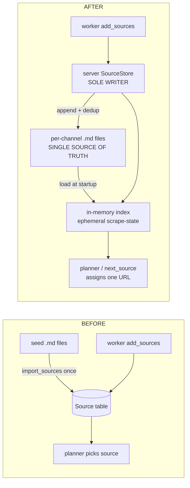
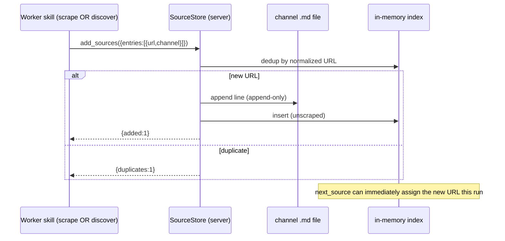

# refactor: Markdown as the single source of truth for scrape sources

**Dual-tree rule:** Every change lands in BOTH trees. Source-of-truth repo `WKG/PRECRIME` (has `docs/`, `CONCEPTS.md`, Prisma schema, `scripts/`) and deployed/test tree `WKG/TDS/precrime` (run `goose.bat` here). Server code (`server/mcp/*.js`) is byte-identical in both. Skill markdown differs only by the deployment token: `{{DEPLOYMENT_NAME}}` in `PRECRIME/templates/skills/`, literal `MyProject` in `TDS/precrime/skills/`. All paths below are repo-relative.

---

## Summary

Sources currently live in a SQLite `Source` table; the markdown seed files are read once at startup (`import_sources`) and then ignored. This inverts the intended model: discovery grows a hidden DB the user can neither see, edit, nor bootstrap, and the productive feeds (e.g. the 3 working RSS blogs) exist only in SQLite.

This refactor makes the **per-channel markdown files the single source of truth** for scrape sources and **removes the `Source` table entirely**. The five MCP action names that the skills already call (`add_sources`, `next_source`, `mark_source`, `import_sources`, `status` source-counts) are **preserved** — only their implementation swaps from Prisma to a new markdown-backed store. The **server is the sole writer** (workers emit one structured `add_sources` call; the server appends to markdown with URL dedup), which keeps the cheap-model worker interface trivial and concurrency-safe. Per-source **scrape-state is ephemeral** (in-memory for the run, never persisted) — markdown stays a clean URL list; fresh runs re-scrape, which is correct for demand-sensing.

Alongside, three coupled fixes that make cold-start real: wire the orphaned `DISCOVER_SOURCES` task into a real Tavily-backed worker skill so PreCrime can grow sources from nothing but `VALUE_PROP`; auto-invoke the existing stale-factlet pruning so old demand is deleted, not hoarded; and add Source→markdown export + table-drop to `scripts/migrate-db.js`.

---

## Problem Frame

PreCrime's intended loop is `VALUE_PROP → discover sources → scrape → factlets → apply → clients/bookings → enrich → judge → HOT`. Two structural defects break cold-start and violate the user's source-of-truth requirement:

1. **Sources are DB-authoritative, not markdown-authoritative.** `prisma.source.*` is the runtime truth; markdown is a one-time seed. Discovery (`add_sources`) writes only to the DB, so the user's plaintext list never grows and productive discovered feeds are invisible and unbackupable.
2. **The cold-start engine is unwired.** `DISCOVER_SOURCES` is created by the planner ([server/mcp/mcp_server.js:4521](server/mcp/mcp_server.js)) but is absent from `WORKER_SKILL_MAP` ([server/mcp/db.js:14](server/mcp/db.js)) and the in-process handler, so it never runs. The only open-web source-finding path is the deferred `last30days` seeder. From an empty slate with a clear `VALUE_PROP`, the system cannot find its first sources.

Compounding: stale factlets are deletable but never deleted in practice (the `recycler` action that prunes them is never auto-invoked and defaults to dry-run), so "current demand" silently rots into stale backlog that gates the planner.

---

## Requirements

- **R1** — Markdown per-channel files are the only repository for scrape sources; user can bootstrap them by hand and they grow over time. (outcome a)
- **R2** — The recursive pipeline reads from and writes to markdown. Discovery and recursion-while-scraping both append to the markdown via the server. (outcome b)
- **R3** — Markdown writes are server-only (single-writer); worker skills keep their existing structured `add_sources` call and never touch files. (fork: write authority)
- **R4** — Per-source scrape-state is ephemeral/in-memory; markdown holds only the URL list. (fork: scrape-state)
- **R5** — The `Source` table and all `prisma.source.*` code are removed; `scripts/migrate-db.js` exports existing Source rows to markdown first, then DROPs the table (no `_legacy_Source` archive). (outcome c, fork: migration finality)
- **R6** — `DISCOVER_SOURCES` is wired to a real worker skill (`discover-sources.md`) that reads `VALUE_PROP`, runs Tavily searches for sources across all channels incl. RSS/social, and registers hits via `add_sources`. Cold-start from nothing-but-`VALUE_PROP` works. (outcome 2)
- **R7** — Stale factlets (older than `factletStaleDays`) are actually deleted on a normal run, not just filterable. (outcome 1)
- **R8** — Orchestrator-agnostic (no `@anthropic-ai/sdk`/Agent SDK), no Windows-only or sqlite-CLI dependencies, AWS-Linux-portable. Both trees updated every change.

---

## Key Technical Decisions

**KTD-1: Preserve the MCP action surface; swap only the implementation.** `add_sources`, `next_source`, `mark_source`, `import_sources`, and the source-counts in `status` keep their names, arguments, and return shapes. The skills (`url-loop.md`, the `*-factlet-harvester` skills) already call these and barely change. This shrinks the blast radius and protects the cheap-model worker interface. _Rationale:_ the inversion the user objects to is *where the data lives*, not *the verbs*. Re-pointing the verbs at markdown fixes it without rewriting every harvester.

**KTD-2: A single `SourceStore` module owns markdown + the in-memory index.** New `server/mcp/sourceStore.js`, imported only by `mcp_server.js` (mirrors the `db.js` boundary — no MCP/HTTP imports). It loads all per-channel files into an in-memory index at startup, serves claims/assignments from memory, and is the **only** code that appends to the markdown files. _Rationale:_ single-writer discipline lives in one place; concurrency safety is structural, not per-call.

**KTD-3: Ephemeral scrape-state (R4).** The in-memory index carries `scrapedThisRun`, `claimedBy`, `clientsFound`, `lastError` per URL; none is written back to markdown. Markdown lines are URL + static metadata only. A fresh process starts with all sources unscraped. _Rationale:_ matches "current demand / no hoarding"; re-scraping a blog each run is how new events are found, not waste. No staleness throttle in v1 (cold-run token cost is explicitly acceptable).

**KTD-4: Server is sole writer (R3).** Workers never edit files. `add_sources` (server-side) normalizes + dedups by URL against the index, appends new lines to the channel's markdown file, and updates the index in the same call. Recursion-while-scraping and `DISCOVER_SOURCES` both flow through this one path, so brainstormed ideas mid-scrape are registered immediately and visible to the next assignment. _Rationale:_ one structured tool call is the easiest thing to ask of gemini-flash; file parsing/append/escape stays in robust server code.

**KTD-5: Claim = in-memory assignment, no file lock.** The conductor/planner is the single dispatcher; `next_source` hands out an unscraped URL from the index and marks it `claimedThisRun` in memory. Because there is one server process holding the index and one dispatcher, two workers cannot be handed the same URL. No DB claim row, no file lock. _Rationale:_ the original reason sources went to the DB (atomic claim across workers) is dissolved by routing claims through the single in-memory index.

**KTD-6: DROP, not archive (R5).** `migrate-db.js` keeps its lossless philosophy for every other table but treats `Source` as an explicit exception: export rows to the channel markdown files (via the same line format), then drop both `Source` and any `_legacy_Source`. _Rationale:_ the user wants the entries gone; the productive feeds are preserved by landing in markdown, which is now the source of truth.

**KTD-7: Auto-invoke factlet pruning (R7).** The deletion code already exists in `pipelineRecycler` ([server/mcp/mcp_server.js:4854](server/mcp/mcp_server.js)). Add a startup call (and a planner-cycle call) to a small internal `pruneStaleFactlets()` with `dryRun:false`, reusing the existing query. _Rationale:_ cheapest correct fix — invocation, not new logic.

**KTD-8: Keep `better-sqlite3` in `migrate-db.js`.** It is already the script's dependency and is cross-platform (not the `sqlite3` CLI). _Rationale:_ R8 forbids the sqlite *CLI*, not a library; swapping to `node:sqlite` adds risk for no benefit here.

---

## High-Level Technical Design

### Source data flow — before vs after



### Write path (single-writer, serves recursion + discovery)



### Markdown line format (per channel)

One URL per line; `#` comments and blank lines ignored; pipe-delimited static metadata only (no scrape-state). Format mirrors the existing `import_sources` parser so current files keep working:

```
# <channel> sources — single source of truth. Bootstrap by hand; the server appends discoveries.
# format: <url> | <label?> | <category?>      (handle channels: bare <handle-or-url> per line)
https://eventsbypurelavish.com/feed | Pure Lavish Events | events
```

---

## Output Structure

```
server/mcp/
  sourceStore.js        # NEW — markdown-backed store + in-memory index, sole writer
  mcp_server.js         # MOD — source actions re-pointed at sourceStore; prune call added
  db.js                 # MOD — DISCOVER_SOURCES added to WORKER_SKILL_MAP
templates/skills/        (PRECRIME)  /  skills/  (TDS)
  discover-sources.md   # NEW — DISCOVER_SOURCES worker (Tavily → add_sources)
  source-discovery/*_sources.md, *-factlet-harvester/*_sources.md   # MOD — headers/format, add website+blog files
scripts/
  migrate-db.js         # MOD — export Source rows → markdown, then DROP Source
prisma/
  schema.prisma         # MOD — remove Source model
```

---

## Implementation Units

### U1. `SourceStore` module — markdown load + in-memory index + sole-writer append

**Goal:** A self-contained module that is the only thing that reads/writes the source markdown files and holds the ephemeral run-state index.
**Requirements:** R1, R2, R3, R4, KTD-2, KTD-3, KTD-4, KTD-5.
**Dependencies:** none.
**Files:** `server/mcp/sourceStore.js` (new), `server/mcp/sourceStore.test.js` (new).
**Approach:**
- Channel→file map + per-channel line format, lifted from the current `pipelineImportSources` seed list ([server/mcp/mcp_server.js:1929](server/mcp/mcp_server.js)). Add `website` and `blog` files to the map.
- `load()` — read every channel file, parse lines (reuse the directory/rss/handle/plain parsers), build `Map<normalizedUrl, {url, channel, subtype, label, category, scrapedThisRun:false, claimed:false, clientsFound:0, lastError:null}>`.
- `addSources(entries)` — normalize (reuse `normalizeSourceUrl`/`inferSubtype`), dedup against the index, **append** new lines to the channel file (append-only write, never rewrite), insert into index; return `{added, duplicates, invalid}`.
- `nextSource(channel?)` — return + mark `claimed` the first unscraped/unclaimed URL (optionally channel-filtered); `{status:'QUEUE_EMPTY'}` when none.
- `markSource(url, {clientsFound, failedReason})` — set `scrapedThisRun=true`, release claim, record counts in-memory only.
- `counts()` — per-channel totals + unscraped counts for `status`.
- Module imports `fs`/`path` only — no Prisma, MCP, or HTTP (mirror `db.js` boundary).
**Patterns to follow:** the parser blocks and `normalizeSourceUrl`/`inferSubtype` in current `pipelineImportSources`; the import-only boundary discipline of `server/mcp/db.js`.
**Test scenarios:**
- Happy: `load()` on a fixture dir with 2 channels builds an index of N urls; comments/blank lines skipped.
- Happy: `addSources` with a new URL appends exactly one line and returns `{added:1}`; the file gains the line, other lines untouched.
- Edge: `addSources` with a URL already present (different case/trailing slash) returns `{duplicates:1}` and appends nothing (normalization dedup).
- Edge: `addSources` with a handle-format channel (`@acct`, `r/sub`) normalizes to canonical URL before dedup.
- Edge: `nextSource` returns each URL at most once per run; after all claimed → `QUEUE_EMPTY`.
- Edge: `markSource` flips `scrapedThisRun` so `nextSource` won't re-hand it this run; nothing is written to the file (ephemeral state).
- Error: `addSources` with an unknown channel → counted `invalid`, no append.
- Integration: `addSources` mid-run makes the new URL immediately claimable by a subsequent `nextSource` (recursion-while-scraping).

### U2. Re-point the five source pipeline actions at `SourceStore`

**Goal:** `add_sources`, `next_source`, `mark_source`, `import_sources`, and the `status` source-counts call `SourceStore` instead of `prisma.source.*`.
**Requirements:** R1, R2, R3, KTD-1.
**Dependencies:** U1.
**Files:** `server/mcp/mcp_server.js` (modify the 6 source-touching handlers; remove the `prisma.source.*` calls at the next_source/mark_source/add_sources/import_sources/status/intake sites).
**Approach:**
- Instantiate one `SourceStore` at server startup; call `load()` once.
- `next_source` → `store.nextSource(channel)`; `mark_source` → `store.markSource(...)`; `add_sources` → `store.addSources(entries)`.
- `import_sources` becomes a no-op shim that returns the load summary (kept so any caller/skill referencing it doesn't error) OR is removed if no caller remains — confirm via grep; default to a deprecation shim returning `{deprecated:true, loaded: counts}`.
- `status` source-counts → `store.counts()`.
- Keep return JSON shapes identical to today so skills and `status` consumers are unaffected.
**Patterns to follow:** existing action dispatch in `handlePipeline`; preserve the `createSuccessResponse` JSON contracts.
**Test scenarios:**
- Happy: `add_sources` action returns the same `{added,duplicates,invalid}` shape as before, now backed by markdown.
- Happy: `next_source`/`mark_source` round-trip a claim without any DB row.
- Edge: `status` reports per-channel counts equal to markdown line counts after load.
- Integration: a `SCRAPE_SOURCE` task lifecycle (claim → scrape → `mark_source` → `add_sources` of a discovered URL) runs end-to-end with no `prisma.source` access (assert via a spy/grep that the table is untouched).
- Verification: `grep -n "prisma.source" server/mcp/mcp_server.js` returns nothing.

### U3. Re-point planner scrape-stage + intake count at `SourceStore`

**Goal:** The planner's `SCRAPE_SOURCE` source selection ([~mcp_server.js:4490](server/mcp/mcp_server.js)) and the intake `claimableSourceCount` ([~mcp_server.js:3668](server/mcp/mcp_server.js)) read from `SourceStore`.
**Requirements:** R1, R2.
**Dependencies:** U1, U2.
**Files:** `server/mcp/mcp_server.js` (planner stage + `computeWorkflowIntakeState`).
**Approach:** replace `prisma.source.findMany`/`prisma.source.count` with `store.nextSource`-style assignment and `store.counts()`. Planner bakes the assigned URL into the `SCRAPE_SOURCE` task input exactly as today (the conductor/worker contract is unchanged).
**Patterns to follow:** current planner Stage that creates `SCRAPE_SOURCE` with a chosen source.
**Test scenarios:**
- Happy: planner assigns distinct URLs to N `SCRAPE_SOURCE` tasks in one pass (no double-assignment).
- Edge: when all sources are scraped-this-run, planner creates 0 `SCRAPE_SOURCE` tasks and (per existing logic) may fall to discovery.
- Integration: `claimableSourceCount` in `status` reflects markdown, not DB.

### U4. Wire `DISCOVER_SOURCES` — worker skill + `WORKER_SKILL_MAP`

**Goal:** `DISCOVER_SOURCES` dispatches to a real Tavily-backed worker that grows the markdown across all channels; cold-start from `VALUE_PROP` works.
**Requirements:** R6, R2, R3.
**Dependencies:** U1, U2 (so `add_sources` writes markdown).
**Files:** `templates/skills/discover-sources.md` (new, PRECRIME) + `skills/discover-sources.md` (new, TDS, `MyProject` literal); `server/mcp/db.js` (add `DISCOVER_SOURCES: 'discover-sources.md'` to `WORKER_SKILL_MAP`).
**Approach:**
- Skill reads `DOCS/VALUE_PROP.md` (trade/segment/geography), runs a few bounded `tavily__tavily_search` queries aimed at *source-bearing* results across channels — directories, RSS feeds (`"<trade>" <region> blog feed`), and social handles (`site:instagram.com`, `r/<region>`), not individual leads.
- For each hit, classify channel and call `precrime__pipeline({action:"add_sources", entries:[...]})` — server appends to markdown. Dedup is server-side.
- One Task, bounded query budget, `judge:false`, complete and stop. Tavily unavailable → complete `cancelled` `tavily_unavailable`.
- Mirror the structure/guardrails of `find-client-sources.md` (bounded search, structured output, never call `plan_tasks`/`judge_affected`).
**Patterns to follow:** `skills/find-client-sources.md` (bounded Tavily worker shape); the `add_sources` entry schema.
**Test scenarios:** (skill is markdown; validate wiring + contract)
- Happy: with `DISCOVER_SOURCES` in `WORKER_SKILL_MAP`, `conductorGetReadyTasks` returns a `DISCOVER_SOURCES` row carrying `skillFile:'discover-sources.md'` (was previously dropped).
- Edge: a `DISCOVER_SOURCES` task on an empty source set still dispatches (cold-start) rather than sitting `ready`.
- Integration: skill's `add_sources` calls land new lines in the correct channel markdown files (incl. rss/ig that recursion never grew).
- Verification: from an empty DB + populated `VALUE_PROP`, one workflow pass produces ≥1 new source line in markdown.

### U5. Auto-invoke stale-factlet pruning

**Goal:** Stale factlets are deleted on a normal run.
**Requirements:** R7, KTD-7.
**Dependencies:** none (independent; can land first).
**Files:** `server/mcp/mcp_server.js` (extract `pruneStaleFactlets()` from `pipelineRecycler`'s factlet block; call at startup cleanup and once per planner cycle with `dryRun:false`).
**Approach:** factor the existing `prisma.factlet.deleteMany({where:{createdAt:{lt: factletCutoff}}})` into a reusable internal fn; the `recycler` action calls it too (no behavior change there). Add a startup invocation next to the existing startup task-cleanup, and a guarded call in the planner cycle. Log counts.
**Patterns to follow:** the startup cleanup fn (~mcp_server.js:3760) and `pipelineRecycler` step 3.
**Test scenarios:**
- Happy: factlet older than `factletStaleDays` is deleted on startup; recent factlet survives.
- Edge: `factletStaleDays` read from `precrime_config.json` (currently 30), not the 180 fallback.
- Edge: prune failure is caught and logged, never crashes startup.
- Integration: after prune, `computeWorkflowIntakeState` recomputes `unprocessedFactletCount` over the surviving set.

### U6. Remove `Source` from schema + migrate-db.js export-then-DROP

**Goal:** The `Source` table is gone from the schema and from any migrated DB; its productive rows are exported to markdown first.
**Requirements:** R5, KTD-6, KTD-8.
**Dependencies:** U1 (line format), U2/U3 (no live code references the table).
**Files:** `prisma/schema.prisma` (remove `Source` model), `scripts/migrate-db.js` (add Source-export step; remove `Source` from canonical `TABLES`; suppress `_legacy_Source`; DROP).
**Approach:**
- In `migrate-db.js`, before table rebuild: read existing `Source` rows; for each, format a markdown line per its channel and **append to the channel file** if not already present (dedup by normalized URL). Report counts per channel (call out the productive RSS feeds).
- Remove `Source` from the canonical `TABLES` map (so it isn't rebuilt) and from the `_legacy_` copy set (so no `_legacy_Source`); explicitly `DROP TABLE IF EXISTS "Source"` and `"_legacy_Source"` in the target.
- Regenerate Prisma client after schema edit (`npx prisma generate`) — note as execution step, not in plan.
**Patterns to follow:** the `TABLES` map + `if (table === 'Source')` row handling (~migrate-db.js:190/425); the existing per-channel line format from U1.
**Test scenarios:**
- Happy: migrating a DB with N Source rows appends N (deduped) lines across the channel files; output DB has no `Source` or `_legacy_Source` table.
- Edge: a Source URL already present in markdown is not duplicated.
- Edge: the 3 productive RSS feeds (eventsbypurelavish/jilliannicoleevents/orangeblossomspecialevents) land in `rss_sources.md`.
- Error: dry-run mode reports the export plan and changes nothing.
- Verification: `node --check scripts/migrate-db.js`; post-migrate `node -e` table list excludes Source; `npx prisma generate` succeeds with no Source references.

### U7. Markdown files, skill references, and docs

**Goal:** Per-channel files exist for all 8 channels with the canonical header/format; skills and docs describe markdown-as-truth.
**Requirements:** R1, R8.
**Dependencies:** U1 (format), U4 (discover skill exists).
**Files:** `skills/source-discovery/discovered_directories.md`, `skills/*-factlet-harvester/*_sources.md` (+ new `website`/`blog` files), `GOOSE.md` (tool-surface + source rules), `CONCEPTS.md` (Source definition), `skills/init-wizard.md` (Step 1.5 import note), `skills/url-loop.md` + harvester skill headers (drop "DB is runtime truth" language). Apply to BOTH trees (placeholder vs `MyProject`).
**Approach:** rewrite each `_sources.md` header to declare it the single source of truth that the server appends to; ensure the line format matches U1; remove the "do NOT write seed files at runtime / DB is authoritative" notes; update `GOOSE.md`'s `add_sources`/`next_source`/`mark_source` descriptions to say "markdown-backed"; update `CONCEPTS.md` §Source to drop the work-stealing-DB framing.
**Patterns to follow:** existing `rss_sources.md` header style.
**Test scenarios:** `Test expectation: none -- documentation/seed content`. Verification: every channel in the `SourceStore` map has a corresponding file that `load()` parses without error; `grep -ri "Source table" GOOSE.md CONCEPTS.md skills/` returns no stale claims.

---

## System-Wide Impact

- **Conductor/worker contract unchanged** — planner still bakes a URL into each `SCRAPE_SOURCE` task; only the source *origin* changes. Cheap-model workers keep the one-call `add_sources` interface (helps gemini-flash; fewer tokens).
- **Restart required** — `SourceStore.load()` runs at MCP server startup; changes take effect on next `goose.bat` launch.
- **Migration is one-way** — after `migrate-db.js` drops `Source`, the markdown files are authoritative. Run the export on the live `TDS/precrime/data/myproject-migrated.sqlite` before deleting anything.
- **`CONCEPTS.md` Source definition changes** — from "work-stealing DB queue" to "markdown list the server appends to."

---

## Risks & Mitigations

- **Risk: concurrent append corruption.** *Mitigation:* single server process, single `SourceStore` writer, append-only writes; workers never write. (KTD-4/5.)
- **Risk: losing the productive discovered feeds during migration.** *Mitigation:* U6 exports Source rows to markdown *before* drop, deduped; explicit test asserts the 3 RSS feeds land.
- **Risk: a missed `prisma.source` reference throws at runtime.** *Mitigation:* U2 verification greps to zero; `node --check` both trees; smoke a workflow pass.
- **Risk: ephemeral state re-scrapes everything → token cost on big lists.** *Accepted* per user (cold-run cost is fine; re-scraping catches new events). Future: optional in-memory staleness throttle.
- **Risk: discover-sources returns leads, not sources.** *Mitigation:* skill prompt targets source-bearing results (feeds/directories/handles), mirrors `find-client-sources` guardrails; bounded query budget.

---

## Sequencing

1. **U5** (independent, immediate win — stale factlets start getting deleted).
2. **U1** → **U2** → **U3** (the store, then the action re-point, then the planner re-point).
3. **U4** (discover wiring — depends on U1/U2 writing markdown).
4. **U6** (schema + migration — after no live code references the table).
5. **U7** (files + docs — last, reflects the final shape).

Each unit lands in BOTH trees and is independently committable.

---

## Deferred to Follow-Up Work

- In-memory per-source staleness throttle (skip re-scrape if scraped < N hours ago **within** a long-running process) — only if cold-run token cost becomes painful.
- `last30days`/`demand-radar` upstream seeder — orthogonal to this refactor; revisit after `discover-sources.md` proves cold-start.
- Consolidating per-channel files into one source file — current per-channel split matches harvester structure; not worth churn now.

---

## Open Questions (execution-time)

- Does any caller still invoke `import_sources`? (grep at U2; shim vs remove.)
- Exact `website`/`blog` query phrasing for `discover-sources.md` — tune against live Tavily during U4.
