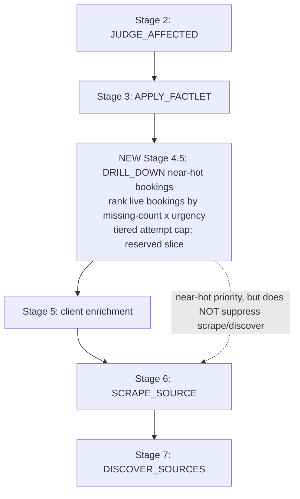

# feat: Active drill-down on near-hot bookings

**Dual-tree rule:** every change lands in BOTH `WKG/PRECRIME` (source) and `WKG/TDS/precrime` (deployed); server code byte-identical, skills differ by `{{DEPLOYMENT_NAME}}` vs `MyProject`. After this plan is implemented the user rebuilds PRECRIME and reinstalls into TDS/precrime. All paths repo-relative.

---

## Summary

PreCrime enriches live clients round-robin (stalest-first) and abandons them after a flat `MAX_FIND_PASSES=3`, regardless of how close to hot they are. `classify()` already computes each brewing booking's `missing[]` (the exact unmet hot prerequisites) and the planner discards it. This feature makes the planner **rank live bookings by closeness** (fewest missing fields, weighted by time-to-event), spawn a **research-only `DRILL_DOWN` worker** that hunts a booking's *specific* missing fields with escalating tools, and **scale effort to closeness** so near-hot bookings aren't abandoned. Drill-down never contacts anyone — outreach stays the existing approval-gated arm.

---

## Problem Frame

(see origin) Many brewing bookings, ~0 hot. The closest-to-hot bookings get the same generic, capped, round-robin enrichment as everything else and age out. The data to do better already exists (`classify().missing[]`) but is unused for scheduling.

---

## Requirements (traceability to origin)

- **R1** Surface `missing[]` per live booking to the planner.
- **R2** Closeness-first scheduling, with a reserved slice for new/cold work.
- **R3** Field-targeted `DRILL_DOWN` task (research-only, tool-escalating).
- **R4** Per-field playbooks (email / date / zip / person-name).
- **R5** Tiered effort by closeness (replaces flat cap).
- **R6** Urgency × closeness priority.
- **R7** Finish-one-leed mode.
- **R8** No auto-outreach.
- **R9** Persist progress (recompute `missing[]`; attempts via task history — no schema change).

---

## Key Technical Decisions

**KTD-1: `DRILL_DOWN` is a new task type, booking-centric.** `targetType:'Booking'`, `targetId = bookingId`, `input:{ clientId, missing:[...], startDate }`. Added to `WORKER_SKILL_MAP` (`server/mcp/db.js`) → `drill-down.md`. _Rationale:_ the unit of work is a *booking* one field from hot, not a client; `FIND_CLIENT_SOURCES` is client-centric and generic. A distinct type lets the planner prioritize and tier it independently.

**KTD-2: `missing[]` is recomputed each cycle via `classify()`; no schema change (R9).** A server helper loads live bookings + their client, runs `classify()` (already exists, cheap, procedural), and returns `{ bookingId, clientId, missing[], startDate }`. Attempts/decay tracked via `DRILL_DOWN` task history (the existing `findPassCount` pattern). _Rationale:_ `classify()` is the single source of truth for "what's missing"; persisting a derived array would drift.

**KTD-3: Closeness + urgency score, computed in the planner.** `score = f(missingCount asc, daysToEvent asc)` — fewer-missing and sooner-event rank higher. A reserved slice of the per-cycle budget still advances scrape/new-client work so cold intake isn't starved (R2). _Rationale:_ the priority inversion lesson — don't let one stage fully starve another ([[planner-priority-inversion-starves-source-stages]]).

**KTD-4: Tiered effort replaces the flat cap (R5, supersedes recent Fix #2).** Max drill-down attempts per booking scales with closeness: `missingCount<=1` → high cap; `<=2` → medium; else low. Applied via `DRILL_DOWN` task count per booking. _Rationale:_ the flat 3-pass abandonment quits on the best leedz; tiering keeps chasing the closest ones.

**KTD-5: Drill-down is research-only (R8).** The worker fills fields via search/extract tools (Tavily, page extract) and `pipeline.save`; it never calls `gmail__gmail_send` or `share_booking`. Outreach stays `DRAFT_OUTREACH` (user-approved). _Rationale:_ hard user constraint on irreversible external actions.

**KTD-6: Finish-one-leed is a `plan_tasks` mode flag (R7).** `objective`/arg `focus:"one_leed"` makes the closeness stage schedule `DRILL_DOWN` for only the single top-ranked booking, concentrating the budget. _Rationale:_ guarantees forward progress on the best opportunity; optional, not default.

---

## High-Level Technical Design

### Where the new stage sits in the planner



### DRILL_DOWN worker loop (research-only, escalating)

```mermaid
sequenceDiagram
  participant P as Planner
  participant W as DRILL_DOWN worker (drill-down.md)
  participant T as Tavily / extract
  participant S as pipeline.save (resolves date, classifies)
  P->>W: task{ bookingId, clientId, missing:[client_email_generic, start_time] }
  loop per missing field, by playbook, escalating tools
    W->>T: targeted search (contact/staff page → LinkedIn → event listing)
    T-->>W: candidate value (email / date / zip / person name)
  end
  W->>S: save(id:clientId, patch:{ email?, bookings:[{dateText?, zip?}], ... }, judge:false)
  S-->>W: affected ids (Judge re-classifies; may go hot)
  W->>P: complete_task(done, output{ bookingIds, summary:"filled <fields>" })
  Note over W: NEVER sends outreach or shares.
```

---

## Implementation Units

### U1. Per-live-booking `missing[]` helper (server)

**Goal:** A server function the planner calls to get each live booking's unmet hot prerequisites + urgency inputs.
**Requirements:** R1, R9, KTD-2.
**Dependencies:** none.
**Files:** `server/mcp/mcp_server.js` (new helper near `computeWorkflowIntakeState`), `server/mcp/classification.test.js` (extend if present, else add a small test harness alongside `sourceStore.test.js` style).
**Approach:** load live bookings (status `brewing`/`cold` with future `startDate`) joined to their client; for each, call `classify(client, booking, opts)` (reuse the exact opts the save path uses — `genericEmailPrefixes`, `orgNameTokens`, `futureMinHours`, `factletCount`). Return `[{ bookingId, clientId, missing, missingCount, startDate, daysToEvent }]`, sorted by score (missingCount asc, daysToEvent asc). Exclude `hot_eligible` (nothing missing) and `cold` (`missing` only meaningful for brewing).
**Patterns to follow:** the save handler's existing `classify()` call (`server/mcp/mcp_server.js`), `computeWorkflowIntakeState`.
**Test scenarios:**
- Happy: a brewing booking missing only `client_email_generic` returns `missingCount:1` and ranks above one missing 3 fields.
- Edge: two bookings both `missingCount:1` — the one with the sooner `startDate` ranks first (urgency tiebreak).
- Edge: a `hot_eligible` booking (nothing missing) is excluded.
- Edge: a past-dated booking is excluded.
- Verification: helper returns ranked list; `classify` opts match the save path (no divergence in generic-email/org-name detection).

### U2. `DRILL_DOWN` worker skill + wiring

**Goal:** A research-only worker that, given a booking + its missing fields, hunts only those fields and saves them.
**Requirements:** R3, R4, R8, KTD-1, KTD-5.
**Dependencies:** U1 (defines the task input shape).
**Files:** `templates/skills/drill-down.md` (new, `{{DEPLOYMENT_NAME}}`/`{{PROJECT_ROOT}}`) + `skills/drill-down.md` (new, TDS `MyProject`); `server/mcp/db.js` (`WORKER_SKILL_MAP['DRILL_DOWN'] = 'drill-down.md'`); `deploy.js` (copy list).
**Approach:** Step 0 load task (`get_task` → `bookingId, clientId, missing[]`); Step 1 per-field **playbooks** — `client_email_generic`/`client_email` → org contact/about/staff page + LinkedIn for a direct personal address; `start_date`/`start_time` → the event's own listing page (capture verbatim `dateText`); `location_with_zip` → venue page / geocode the venue; `client_name_not_person`/`client_name` → find the named decision-maker. Escalate tools per field (Tavily search → `tavily_extract` the official page → social). Step 2 save found fields via `pipeline.save(id:clientId, judge:false, patch:{...})` — emails/phone/name on the client; `dateText`/`zip`/`startTime` inside `bookings:[{ ... , sourceUrl }]`. Step 3 `complete_task(done, output:{ clientIds, bookingIds, factletIds:[], sourceIds:[], summary, needsJudge:true })`. **Never** call `gmail__gmail_send`, `share_booking`, `plan_tasks`, `judge_affected`. Mirror `find-client-sources.md` guardrails.
**Patterns to follow:** `skills/find-client-sources.md` (bounded worker), `skills/shared/booking-detect.md` (booking save shape: `dateText`+`sourceUrl`), `discover-sources.md` (channel/tool discipline).
**Test scenarios:** (skill markdown — validate wiring + contract)
- Happy: `conductorGetReadyTasks` returns a `DRILL_DOWN` row carrying `skillFile:'drill-down.md'` (was previously unhandled).
- Edge: a booking whose only gap is `start_time` triggers only the date/time playbook (no contact search).
- Integration: a save with a resolved `dateText` + non-generic email flips the booking to `hot` via the Judge (end-to-end on a fixture).
- Verification: skill contains no `gmail`/`share_booking`/`plan_tasks` calls; build (`deploy.js`) stages `drill-down.md` with placeholders substituted.

### U3. Closeness + urgency scheduling stage with tiered effort

**Goal:** A planner stage that schedules `DRILL_DOWN` for the closest live bookings first, with effort tiered to closeness and a reserved slice for other work.
**Requirements:** R2, R5, R6, KTD-3, KTD-4.
**Dependencies:** U1, U2.
**Files:** `server/mcp/mcp_server.js` (new stage in `pipelinePlanTasks`, before Stage 5 enrichment; `precrime_config.json` limits/budgets add `DRILL_DOWN`).
**Approach:** call U1's helper; for each ranked booking, compute its tiered attempt cap (`missingCount<=1`→high, `<=2`→med, else low) and the count of prior `DRILL_DOWN` tasks for that booking (the `findPassCount` pattern, `targetType:'Booking'`); schedule a `DRILL_DOWN` task while under cap and under the per-cycle `DRILL_DOWN` budget. **Reserve a slice:** cap drill-down scheduling at N per cycle so enrichment/scrape still run. Must NOT suppress `SCRAPE_SOURCE`/`DISCOVER_SOURCES` (priority-inversion lesson). Add `DRILL_DOWN` to `precrime_config.json` `tasks.limits` and `tasks.sessionBudgets`.
**Patterns to follow:** Stage 5 enrichment loop + `findPassCount`/`MAX_FIND_PASSES` (`server/mcp/mcp_server.js`); the budget helpers `createBudget`/`countReady`.
**Test scenarios:**
- Happy: with two near-hot bookings (missing 1 field each), the planner schedules `DRILL_DOWN` for both, highest-urgency first.
- Edge: a booking at its tiered attempt cap gets no new `DRILL_DOWN`.
- Edge: tiering — a `missingCount:1` booking gets more attempts than a `missingCount:3` booking before being capped.
- Edge: the reserved slice holds — `SCRAPE_SOURCE`/`DISCOVER_SOURCES` are still createable in the same cycle (no suppression).
- Integration: scheduling → worker fills the field → Judge promotes → the booking drops out of the near-hot list next cycle.

### U4. Finish-one-leed mode

**Goal:** An optional mode that concentrates the cycle's drill-down budget on the single top-ranked near-hot booking.
**Requirements:** R7, KTD-6.
**Dependencies:** U3.
**Files:** `server/mcp/mcp_server.js` (`pipelinePlanTasks` reads `args.focus === 'one_leed'` or objective), `GOOSE.md` + `templates/GOOSE.md` (document the flag in the routing/objective notes).
**Approach:** when the flag is set, U3's stage schedules `DRILL_DOWN` for only `ranked[0]` (and re-targets it each cycle until it's hot or hits its cap), ignoring the rest. Everything else unchanged.
**Test scenarios:**
- Happy: with the flag, only the top-ranked booking gets `DRILL_DOWN`; the 2nd-ranked does not.
- Edge: once the top booking is hot or capped, the next-ranked becomes the focus.
- Verification: default (flag absent) behavior unchanged from U3.

### U5. Docs + concepts

**Goal:** Surface the new task type and "near-hot drill-down" concept so the agent and future readers understand it.
**Requirements:** R3 (discoverability).
**Dependencies:** U2, U3.
**Files:** `GOOSE.md` + `templates/GOOSE.md` (add `DRILL_DOWN` to the Worker map + tool-surface), `CONCEPTS.md` (add "near-hot" + "DRILL_DOWN" entries), `init-wizard`/architecture notes as needed.
**Approach:** add `DRILL_DOWN -> drill-down.md` to the GOOSE.md Worker list; one-line `CONCEPTS.md` entries for **near-hot booking** (a brewing booking missing ≤1 hot prerequisite) and **drill-down** (the research-only task that hunts a booking's specific missing fields).
**Test scenarios:** `Test expectation: none -- documentation`. Verification: `grep` shows `DRILL_DOWN` in GOOSE.md Worker map (both trees) and CONCEPTS.md defines near-hot.

---

## System-Wide Impact

- **Conductor:** already dispatches any type in `WORKER_SKILL_MAP` per-file at dispatch (no restart for skill edits; server restart needed for the planner stage + config).
- **Judge:** unchanged — promotion still happens server-side on save; drill-down just supplies the missing inputs.
- **Build/rebuild:** the new `drill-down.md` must be in `deploy.js`'s copy list (U2) so the rebuild ships it. `precrime_config.json` gains `DRILL_DOWN` limits/budgets.
- **Supersedes:** the recent flat-cap Fix #2 for live clients — tiered effort (U3) is the new policy; keep the cold/far cap, lift it for near-hot.

---

## Risks & Mitigations

- **Risk: drill-down loops forever on unfindable fields.** *Mitigation:* tiered cap still bounds attempts (U3); a near-hot booking that exhausts its high cap stops.
- **Risk: near-hot scheduling starves cold intake.** *Mitigation:* reserved slice + no suppression of scrape/discover (U3).
- **Risk: a worker sends outreach.** *Mitigation:* KTD-5 + skill guardrails + a verification grep (U2); outreach tools are simply not used by the skill.
- **Risk: `save` rejects a resolved date not proven on the page.** *Accepted* (anti-hallucination); the worker must pass a real `sourceUrl`.

---

## Sequencing

U1 → U2 → U3 → U4 → U5. U1 (helper) and U2 (skill+wiring) are independent enough to build in either order; U3 needs both. U4/U5 are thin add-ons after the spine works.

---

## Deferred to Follow-Up Work

- Cross-source date/budget verification beyond the source page.
- A human-in-the-loop "ask the organizer to confirm" automation.
- Persisting a materialized near-hot worklist (current design recomputes — revisit only if `classify()` over many bookings becomes a hotspot).
