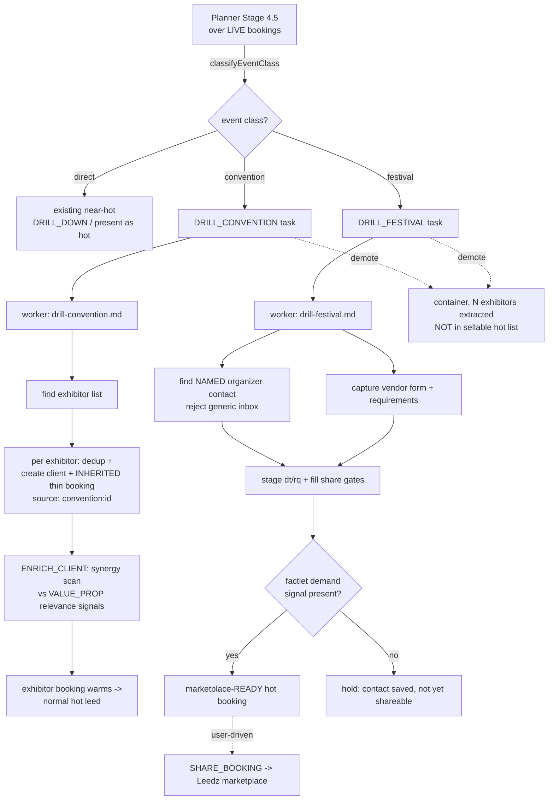

# feat: Convention & Festival drill-down subclasses

> **Design revision (2026-06-30, post-implementation).** During review the design was simplified
> twice and the code reflects the revised shape, not the original three-way split below:
> 1. **Detector is binary `direct | container`** (not `direct | convention | festival`). The event
>    SUBJECT/type never mattered — only whether the event gathers vendors/a crowd. Tournaments,
>    championships, expos, festivals, and fairs are all `container`; a tournament at a convention
>    center is a container exactly like a trade show. A single private host (wedding, company party,
>    franchise promo night) is `direct`. The venue-name strip was removed.
> 2. **One task type `DRILL_CONTAINER`** (the two below, `DRILL_CONVENTION` + `DRILL_FESTIVAL`, were
>    collapsed). Its worker `templates/skills/drill-container.md` runs: **VALUE_PROP fit gate first**
>    (using `DOCS/VALUE_PROP.md`'s `## RELEVANCE SIGNALS` / `### Not Relevant Signals` as the
>    authoritative fit criteria — NOT topic-match) → find named organizer → expand fitting vendors
>    (each with an inherited booking) → prep marketplace listing.
>
> The unit-by-unit plan below is preserved as the original record; read it through that lens.

## Summary

PRECRIME currently treats every dated, located, trade-matched booking as a sellable
leed. That is wrong for two whole classes of event:

- A **convention / trade show** ("LA Auto Show", "ADLM Clinical Lab Expo") is not a
  prospect — it is a *container full of prospects* (its exhibitors). We should drill
  into it, extract the exhibitor list, and mint one warm leed per exhibitor.
- A **festival / street fair** ("Grand Park Summer Block Party", "FoodieLand") is a
  single opportunity the seller will often *pass on* (busy, too far, wrong genre). It
  should be made **marketplace-ready** — a real named organizer contact, a captured
  vendor application, and an LLM-synthesized listing — so it can be SHARED to the
  Leedz marketplace for other sellers.

Both behaviors are "subclasses of DRILL_DOWN": same place in the planner (Stage 4.5),
same research-only worker discipline, but different cardinality and terminus. This plan
adds an **event-class detector** (`direct | convention | festival`), two new task types
(`DRILL_CONVENTION`, `DRILL_FESTIVAL`), their worker skills, planner routing, and a
presenter change that demotes containers out of the sellable hot list.

No schema migration is required: event-class is computed deterministically from booking
text, expansion provenance rides the existing `source: "convention:<id>"` convention,
and "already drilled" reuses the Task audit trail the drill-down planner already queries.

---

## Problem Frame

The procedural classifier (`server/mcp/classification.js`) decides hot/brewing/cold from
**field completeness only** — it has no concept of *what kind of event* a booking is. So a
convention that happens to have a real contact and a venue passes the gates and surfaces as
hot leed #1, even though pitching the Auto Show itself is pointless. The intelligence we
already have (it is an expo; its venue is a convention center; its description mentions
exhibitors) is never acted on.

The parked skill `templates/skills/TMP/convention-leed-pipeline.md` already describes the
exhibitor-expansion flow as a *manual* end-to-end pipeline, but it is not wired into the
autonomous Planner → Conductor → Worker loop. This plan promotes that idea into a
first-class autonomous task type and adds the festival/marketplace counterpart.

---

## Requirements

- **R1** — Detect a booking's event-class (`direct | convention | festival`) deterministically
  from its title/description/location, independent of contact completeness or hot/brewing state.
- **R2** — For convention-class bookings, the planner schedules a research-only worker that finds
  the exhibitor list and mints one client per exhibitor, **each born with a thin booking** that
  inherits the convention's `location`, `zip`, `startDate`, `startTime`, and `title`.
- **R3** — Exhibitor enrichment looks for **synergy with VALUE_PROP** (evidence the vendor has used
  the service category before, e.g. a prior photo booth at their booth). Synergy warm-starts the
  inherited booking.
- **R4** — For festival-class bookings, the planner schedules a research-only worker that finds a
  **real named organizer contact** (never a generic `info@`/`events@` inbox) and, when present,
  captures a **vendor-application link/PDF** plus requirements.
- **R5** — The festival worker prepares the booking to be **marketplace-ready** (status hot +
  contactGate + confirmed trade + description + zip + dates) and stages LLM-synthesized listing
  prose (`dt` selling-point, `rq` vendor-form/requirements). It does **not** auto-share.
- **R6** — A festival with a present demand signal (VALUE_PROP-like service has appeared at it
  before, per factlets) easily qualifies for marketplace-share status.
- **R7** — Convention and festival **containers are demoted** from the sellable hot-leedz
  presentation and relabeled as containers; the leedz they *spawn* appear as normal hot leedz.
- **R8** — Neither worker contacts anyone or auto-shares; both obey the existing research-only
  worker rules. Marketplace posting stays the user-driven `SHARE_BOOKING` path.
- **R9** — No database schema migration; no business-specific data enters the source repo.

---

## Key Technical Decisions

**KTD1 — Two new sibling task types, not a subtype flag.** `DRILL_CONVENTION` (1→many fan-out)
and `DRILL_FESTIVAL` (1→1 marketplace prep) are structurally different jobs from the existing
gap-filler `DRILL_DOWN`. Separate types give each its own focused worker skill, its own
concurrency slice in `_TASK_TYPE_LIMITS_DEFAULT`, and its own session budget — without bloating
`drill-down.md` into a three-way branch. They still live under the conceptual "drill-down" umbrella
in the planner's Stage 4.5. *(Considered: `input.kind` subtype on `DRILL_DOWN` — rejected because
budgets and worker logic diverge too much.)*

**KTD2 — Detector is a pure function in `classification.js`, computed on the fly.** Event-class is
derived from booking text every time it is needed (planner routing, presenter). No persisted field,
no migration. It sits beside the existing deterministic gates and is unit-testable in isolation.

**KTD3 — Detection runs on ALL live bookings, including hot ones.** A convention can satisfy the
field gates and be `status:hot` yet still need expansion. So routing cannot piggyback on
`computeNearHotBookings()` (cold/brewing only); the planner runs the detector over live bookings
independently. The presenter demotion (R7) is what stops an un-expanded hot convention from being
mistaken for a prospect.

**KTD4 — Exhibitors are born with an inherited thin booking; they never enter the bare-client
drill-down.** The convention worker writes each exhibitor with `bookings:[{...inherited event
fields, source:"convention:<id>"}]` in a single save. This means an exhibitor arrives already
near-hot on location/date — the synergy scan only has to add contact + demand to finish it.

**KTD5 — Festival terminus is marketplace-READY, not auto-shared.** The worker fills the share
gates and stages `dt`/`rq` prose into `booking.description`/`booking.notes`; the actual post stays
the sanctioned, user-driven `SHARE_BOOKING` path (`server/mcp/db.js` deliberately excludes
SHARE_BOOKING from conductor auto-run). Preserves the "research workers never publish" rule.

**KTD6 — Synergy reuses existing VALUE_PROP demand machinery.** `collectValuePropDemandTerms()` /
`factletMentionsValueProp()` / `normalizeDemandText()` in `server/mcp/factlets.js` already tokenize
VALUE_PROP relevance signals. The synergy scan matches enriched exhibitor text against those terms
rather than inventing a new vocabulary.

---

## High-Level Technical Design

---

## Implementation Units

### U1. Event-class detector in classification.js

**Goal:** A pure function that labels a booking `direct | convention | festival`.
**Requirements:** R1.
**Dependencies:** none.
**Files:** `server/mcp/classification.js`, `server/mcp/classification.test.js` (new).
**Approach:** Add `classifyEventClass(booking)` returning one of the three labels. Match on
lowercased `title + description + location`:
- `convention` — tokens like `expo`, `convention`, `trade show`, `comic con`, `\bcon\b`,
  `exhibitor`, `exhibit hall`, `booth`, or a convention-center venue (`convention center`,
  `expo center`, `fairplex`, known LACC/Anaheim names from VALUE_PROP geography).
- `festival` — `festival`, `street fair`, `block party`, `food fest`, `fair\b`, `carnival`,
  `parade`, `night market`.
- `direct` — default when neither set matches.
Convention tokens take precedence over festival when both appear (a "festival expo" is a
container). Export `classifyEventClass`. No DB, no LLM — same discipline as `classify()`.
**Patterns to follow:** the existing token-set helpers `isOrgName` / `isGenericEmail` in the
same file (whole-word matching, default token lists).
**Test scenarios:**
- "LA Auto Show 2026" / desc "consumer auto show at LACC" → `convention`.
- "LA Comic Con 2026" → `convention` (matches `comic con`).
- "Grand Park Summer Block Party" → `festival`.
- "FoodieLand Food Festival" → `festival`.
- "Acme Corp holiday party" (no tokens) → `direct`.
- "Spring Arts Festival Expo" (both) → `convention` (precedence).
- empty/null booking text → `direct` (no throw).
**Verification:** new unit tests pass; `classify()` behavior unchanged (detector is additive).

### U2. Register DRILL_CONVENTION + DRILL_FESTIVAL task types

**Goal:** Wire the two types through the worker-dispatch and budget layers.
**Requirements:** R2, R4.
**Dependencies:** U1.
**Files:** `server/mcp/db.js`, `server/mcp/conductor.js`, `server/mcp/mcp_server.js`.
**Approach:**
- `db.js` `WORKER_SKILL_MAP`: add `DRILL_CONVENTION → 'drill-convention.md'`,
  `DRILL_FESTIVAL → 'drill-festival.md'`.
- `conductor.js` `gooseExtArgs`: add both types to the tavily research group (exhibitor/organizer
  research needs Tavily; same scoping as `DRILL_DOWN`). Add `taskDesc()` cases so log lines read
  e.g. `convention <id> -> exhibitors` / `festival <id> -> organizer+vendor-form`.
- `mcp_server.js` `_TASK_TYPE_LIMITS_DEFAULT` + `_TASK_SESSION_BUDGETS_DEFAULT`: add concurrency
  limits and per-session budgets for both (start conservative: limit 2 concurrent each; session
  budget ~10 conventions / ~15 festivals — tune after first live run).
**Patterns to follow:** the existing `DRILL_DOWN` entries in all three files.
**Test scenarios:** `Test expectation: none -- pure registration/config; covered indirectly by U3
boot test and the live conductor skill-gap check.`
**Verification:** server boot-test passes; conductor "skill check OK — all N worker skills present"
count increases by 2 once U4/U7 skills are deployed.

### U3. Planner Stage 4.5 routing for conventions

**Goal:** Detect convention-class live bookings and emit one `DRILL_CONVENTION` each, skipping
already-expanded conventions.
**Requirements:** R2, R7 (routing half).
**Dependencies:** U1, U2.
**Files:** `server/mcp/mcp_server.js`.
**Approach:** In/adjacent to Stage 4.5, load live bookings (future-dated, not shared), run
`classifyEventClass` over them. For each `convention`:
- skip if a terminal/open `DRILL_CONVENTION` already targets that booking (reuse the Task
  audit-trail pattern already used for `DRILL_DOWN` per-booking caps);
- otherwise `createTask('DRILL_CONVENTION', { targetType:'Booking', targetId, input:{ clientId,
  conventionContext:{ location, zip, startDate, startTime, title } } })`.
The inherited `conventionContext` is what U4 copies into each exhibitor. Respect the new budget
from U2. Do not suppress scrape/discovery stages (the planner-priority-inversion learning in
`docs/solutions/`).
**Patterns to follow:** Stage 4.5's existing near-hot loop, `drillCounts`/`skipB` audit-trail
guards, `createBudget('DRILL_DOWN')` budget gating.
**Test scenarios:**
- Covers R2. A future convention booking with no prior DRILL_CONVENTION → one task created with
  `conventionContext` populated from the booking.
- A convention already having an open/terminal DRILL_CONVENTION → no duplicate task.
- A `direct` booking → no DRILL_CONVENTION task (routing leaves it to existing flow).
- budget exhausted → stops creating tasks (no overrun).
**Verification:** seed a convention booking in a test DB; run the planner; assert exactly one
DRILL_CONVENTION task with the expected input shape and no duplicate on a second pass.

### U4. drill-convention.md worker skill (exhibitor expansion)

**Goal:** Autonomous research-only worker: convention booking → exhibitor list → N clients each
with an inherited thin booking.
**Requirements:** R2, R8.
**Dependencies:** U2, U3.
**Files:** `templates/skills/drill-convention.md` (new), `deploy.js` (skill allowlist).
**Approach:** Adapt the parked `templates/skills/TMP/convention-leed-pipeline.md` into the
one-claimed-task worker shape (mirror `drill-down.md`'s Step 0 load / wrong-type guard / research /
save / complete / stop structure). Per exhibitor: dedup by company first (mandatory), then ONE
`save` with client identity fields + `bookings:[{ ...conventionContext from task.input,
source:"convention:<conventionId>", sourceUrl:"<exhibitor-list page>" }]`. `judge:false`. Never
contact anyone; never `share_booking`; never `plan_tasks`. Complete with the affected client/booking
ids and `needsJudge:true`. Add the two `[src,dst]` rows to the `deploy.js` skill array (the new
skill plus its festival sibling from U7).
**Patterns to follow:** `templates/skills/drill-down.md` (worker contract, save shape, completion),
`templates/skills/TMP/convention-leed-pipeline.md` (exhibitor steps), `skills/shared/classify-contact.md`
(dedup-first).
**Test scenarios:** `Test expectation: none -- skill playbook (LLM-executed prose). Validated by the
live goose run in U9; correctness of the resulting writes is enforced server-side by save dedup +
the Judge.`
**Verification:** after deploy, `skills/drill-convention.md` exists; conductor skill-gap check passes;
a live DRILL_CONVENTION run creates exhibitor clients each carrying an inherited booking with
`source:"convention:<id>"`.

### U5. Exhibitor synergy enrichment (warm-start)

**Goal:** When enriching an exhibitor, detect VALUE_PROP synergy (prior/likely use of the service
category) and record it so the Judge warms the inherited booking.
**Requirements:** R3.
**Dependencies:** U4.
**Files:** `templates/skills/enrichment-agent.md` (extend), optionally a small helper in
`server/mcp/factlets.js` if a reusable synergy check is warranted.
**Approach:** Add a synergy step to enrichment for clients whose `source` starts with `convention:`:
search for evidence the exhibitor has used the service category before (matching VALUE_PROP relevance
signals via the existing demand-term machinery) and write that finding into the dossier/notes so the
Judge's PMF gate rewards it. Keep it research-only; do not fabricate evidence. No new scoring math —
the inherited fields plus a real synergy note are what move the booking toward hot.
**Patterns to follow:** `server/mcp/factlets.js` `collectValuePropDemandTerms` /
`factletMentionsValueProp` / `normalizeDemandText`; existing enrichment dossier-append convention.
**Test scenarios:**
- Covers R3. An exhibitor whose enriched text matches a VALUE_PROP relevance signal → synergy note
  recorded; re-judge moves the booking warmer than an identical exhibitor with no synergy evidence.
- An exhibitor with no synergy evidence → no fabricated note; booking stays at its inherited level.
**Verification:** on a seeded exhibitor with a known prior-use signal, enrichment writes a synergy
note and the Judge raises the booking score relative to a no-signal control.

### U6. Demote convention/festival containers from the hot presentation

**Goal:** Containers stop appearing as sellable hot leedz; they are relabeled; spawned leedz appear
normally.
**Requirements:** R7.
**Dependencies:** U1.
**Files:** `server/mcp/mcp_server.js` (SHOW_HOT_LEEDZ in-process handler), `server/mcp/find.js`
(the `bookings` + `status:hot` presenter path).
**Approach:** When assembling the hot-leedz presentation, run `classifyEventClass` on each hot
booking; exclude `convention`/`festival` from the sellable list and surface them in a separate
"containers" summary line (`N conventions / M festivals — drilling for exhibitors/organizers`). A
festival that has reached marketplace-ready may still be listed under a marketplace heading rather
than the outreach hot list (objective-aware).
**Patterns to follow:** the existing SHOW_HOT_LEEDZ assembly and `find.js` `findBookings` summary
shaping.
**Test scenarios:**
- Covers R7. A hot convention booking → absent from the sellable hot list, present in the container
  summary count.
- A hot `direct` booking → still present in the sellable hot list (no regression).
- An exhibitor's (direct) booking spawned from a convention → present in the sellable hot list.
**Verification:** with a hot convention + a hot direct booking seeded, the presenter output lists only
the direct one as sellable and reports the convention under containers.

### U7. drill-festival.md worker skill + festival planner routing

**Goal:** Festival-class bookings get an organizer-contact + vendor-form worker and become
marketplace-ready.
**Requirements:** R4, R5, R6, R8.
**Dependencies:** U2, U3 (routing pattern), U6 (demotion).
**Files:** `templates/skills/drill-festival.md` (new), `server/mcp/mcp_server.js` (festival routing
branch in Stage 4.5), `deploy.js` (skill allowlist — same array edit as U4).
**Approach:**
- Routing: mirror U3 for `festival` class → `createTask('DRILL_FESTIVAL', { targetType:'Booking',
  targetId, input:{ clientId, festivalContext:{...} } })`, audit-trail dedup, festival budget.
- Worker `drill-festival.md`: load festival booking → find a **named** organizer (reject generic
  inbox; keep digging) → capture vendor-application link/PDF + requirements → ONE `save` writing the
  named contact (so `contactGate` can pass), the confirmed trade, a synthesized selling-point
  `description` (the `dt` source) and the vendor form/requirements into `notes` (the `rq` source),
  plus zip/dates. `judge:false`; never contact anyone; never `share_booking`. The factlet demand
  signal (R6) is read by the Judge at re-score time — the worker does not self-promote.
**Patterns to follow:** `templates/skills/drill-down.md` (worker contract), `server/mcp/share.js`
(which fields the marketplace payload reads — `dt`←description, `rq`←notes, plus trade/zip/dates/
contactGate gates) so the worker fills exactly what SHARE_BOOKING later requires.
**Test scenarios:** `Test expectation: none -- skill playbook + routing. Routing validated like U3
(one task per festival, no dup, budget-bounded); marketplace-readiness validated in U9 by re-judging
a filled festival booking and confirming share_booking(mode:draft) returns a payload rather than a
gate-fail.`
**Verification:** a seeded festival booking, after the worker's save + re-judge, passes the
`share_booking` draft gates (hot + contactGate + trade + description + zip + dates) and yields a
`dt`/`rq`-populated draft payload.

### U8. Deploy wiring + boot/skill-gap verification

**Goal:** New skills ship; module changes deploy; the conductor's startup skill-gap check passes.
**Requirements:** R9.
**Dependencies:** U1–U7.
**Files:** `deploy.js` (skill array already edited in U4/U7; confirm both rows present), and confirm
no new business data is shipped.
**Approach:** Ensure `drill-convention.md` and `drill-festival.md` are in the deploy skill array.
The modified server modules (`classification.js`, `db.js`, `conductor.js`, `mcp_server.js`,
`factlets.js`, `find.js`) already deploy via the existing module copy. Run the standard boot-test
(`OPENAI_API_KEY=dummy TAVILY_API_KEY=dummy node server/mcp/mcp_server.js` → reaches "Listening" +
conductor ready) to prove the module graph evaluates and the skill-gap check is clean.
**Patterns to follow:** existing `deploy.js` skill-array rows; the boot-test method.
**Test scenarios:** `Test expectation: none -- deploy/config. Verified by boot test + conductor skill
check.`
**Verification:** boot test reaches the conductor "skill check OK — all N worker skills present" line
with N increased by 2; no business-specific file is added to the source repo.

### U9. Live validation pass

**Goal:** Confirm the convention path (and then festival) behaves end-to-end against a real run.
**Requirements:** R2–R7.
**Dependencies:** U1–U8.
**Files:** none (validation only; scratch test DB + harness under the session scratchpad).
**Approach:** Seed a convention booking and a festival booking in a copy DB; run the planner to
confirm one task of each type with correct inputs; for conventions, dry-run the worker save shape
(client + inherited booking) and confirm the presenter demotes the container; for festivals, fill
the booking as the worker would and confirm `share_booking(mode:draft)` returns a payload. Then a
live goose run to watch DRILL_CONVENTION spawn/complete.
**Patterns to follow:** the DB-diff validation harness used for the C1/C2 perf changes.
**Test scenarios:** `Test expectation: none -- this unit IS the integration verification for R2–R7.`
**Verification:** planner emits the right tasks; presenter demotes containers; a filled festival
passes share gates; a live convention run completes without conductor errors.

---

## Scope Boundaries

**In scope:** event-class detector; `DRILL_CONVENTION` + `DRILL_FESTIVAL` task types, workers,
planner routing, budgets; exhibitor inherited-booking warm-start + synergy enrichment; festival
marketplace-readiness prep; container demotion in the presenter; deploy wiring.

**Deferred to Follow-Up Work:**
- Auto-sharing festivals to the marketplace (stays user-driven `SHARE_BOOKING`; only readiness is
  automated here).
- Tuning the detector token lists / budgets after observing real runs.
- A dedicated exhibitor-list scraper (browser channel) if Tavily extraction proves insufficient.
- Recursion (an exhibitor that is itself a convention organizer).

**Non-goals / out of scope:** changing the Judge's scoring math; any schema migration; contacting
clients from a research worker; non-US venue/timezone handling.

---

## Risks & Mitigations

- **Detector false-positives** (a `direct` booking mis-tagged convention and wrongly demoted).
  *Mitigation:* conservative, whole-word token lists with unit tests (U1); demotion only hides from
  the sellable list, it does not delete — recoverable.
- **Exhibitor-list extraction unreliable via Tavily.** *Mitigation:* worker saves whatever it finds
  (company-only records are still progress per the parked skill's rules); browser scraper deferred.
- **Convention expansion floods the client table.** *Mitigation:* conservative per-session budgets
  (U2) and per-convention audit-trail dedup (U3); tune after first run.
- **Festival reaches marketplace-ready but the trade is only inferred.** *Mitigation:* `share.js`
  already refuses marketplace posting without a confirmed trade — the worker must write a real trade,
  and the gate is the backstop.

---

## Open Questions (deferred to implementation)

- Exact convention/festival token lists and which belong in VALUE_PROP config vs. hardcoded defaults
  (resolve while writing U1 against real titles seen in the DB).
- Whether the synergy check (U5) is best as enrichment-skill prose or a reusable `factlets.js` helper
  (decide when wiring U5 against the actual enrichment flow).
- Final budget/limit numbers (U2) — set conservative, tune from the U9 live run.
